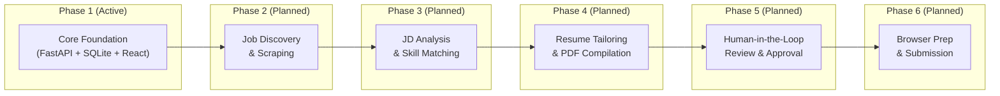
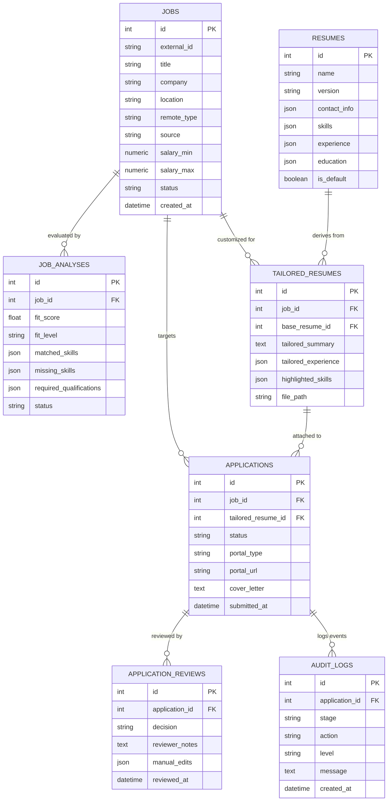

# System Architecture & Roadmap: AI Job Application Agent

## 1. Executive Summary & Design Principles

The **AI Job Application Agent** is designed as a secure, local-first, sequential pipeline for discovering, analyzing, tailoring, approving, and applying to software and engineering roles. 

### Core Architectural Principles
1. **Local-First & Cloud-Free**: Complete data isolation. All candidate information, master resumes, and telemetry reside locally within SQLite and structured disk storage without third-party cloud infrastructure requirements.
2. **Deterministic Human-in-the-Loop Gate**: The agent never performs automated job submissions without explicit human review and cryptographic approval state transitions.
3. **Unified API & Error Contracts**: Standardized envelopes for success payloads and error diagnostics (RFC-7807 compliant with correlation Request IDs).
4. **Modular Phased Evolution**: Decoupled domain stages enabling independent testability and clear contract boundaries.

---

## 2. End-to-End Pipeline Architecture (6 Phases)



### Stage Breakdown

| Phase | Stage Name | Status | Key Responsibilities | Primary Data Models |
| :--- | :--- | :--- | :--- | :--- |
| **Phase 1** | **Core Foundation** | **ACTIVE** | FastAPI server, SQLite WAL, Alembic migrations, React dashboard, structured logging, error contract, health/readiness probes | Base schema, audit logging, health diagnostic subsystems |
| **Phase 2** | **Job Discovery** | *Planned* | ATS & career page scraping (Greenhouse, Lever, Workday), search query filtering, deduplication | `jobs` |
| **Phase 3** | **JD Analysis** | *Planned* | NLP/LLM extraction of requirements, fit scoring (0-100), keyword taxonomy alignment | `job_analyses` |
| **Phase 4** | **Resume Tailoring** | *Planned* | Non-hallucinatory resume customization, bullet re-weighting, cover letter generation, PDF compilation | `resumes`, `tailored_resumes` |
| **Phase 5** | **Human Approval** | *Planned* | Review queue, manual diff editing, review notes, explicit submission gate | `applications`, `application_reviews` |
| **Phase 6** | **Browser Submission**| *Planned* | Portal field mapping, browser automation with Playwright/Puppeteer, submission verification | `applications`, `audit_logs` |

---

## 3. Database Architecture & Entity Relationships

The relational model is built with **SQLAlchemy 2.0** and managed through **Alembic** migrations using **SQLite** with Write-Ahead Logging (WAL) and foreign key constraints enabled.



---

## 4. Unified API Error Contract (RFC 7807 Compliant)

All HTTP error responses from the FastAPI backend follow a strict JSON schema:

```json
{
  "error": {
    "code": "RESOURCE_NOT_FOUND",
    "message": "Job with id 42 was not found",
    "details": {
      "job_id": 42
    },
    "request_id": "req-9b8e21a7cd84",
    "timestamp": "2026-08-23T12:00:00.000000Z"
  }
}
```

### Standard Error Codes

- `VALIDATION_ERROR` (HTTP 422): Field validation failure on request payload or query parameters.
- `RESOURCE_NOT_FOUND` (HTTP 404): Target entity does not exist.
- `BAD_REQUEST` (HTTP 400): Malformed business request or unmet pre-condition.
- `CONFLICT_ERROR` (HTTP 409): Unique constraint or duplicate entity conflict.
- `PIPELINE_STAGE_NOT_ACTIVE` (HTTP 501): Accessing an endpoint belonging to a future phase not yet activated.
- `DATABASE_ERROR` (HTTP 500): Database transaction failure (internal details masked from consumer).
- `INTERNAL_SERVER_ERROR` (HTTP 500): Catch-all unhandled exception handler ensuring stack trace isolation.

---

## 5. Security & Isolation Model

1. **Correlation Tracing**: Every request is assigned a unique `X-Request-ID` propagated through Python's `contextvars` into structured log outputs.
2. **Local Data Storage**: Files, parsed resumes, and compiled PDFs are isolated to `./data/storage`.
3. **CORS Boundary**: Configured via `CORS_ORIGINS` in `.env` to restrict cross-origin access strictly to designated local frontend ports.
4. **Sanitized Public Config**: Sensitive environment variables are never exposed via public endpoints.
